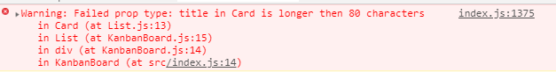
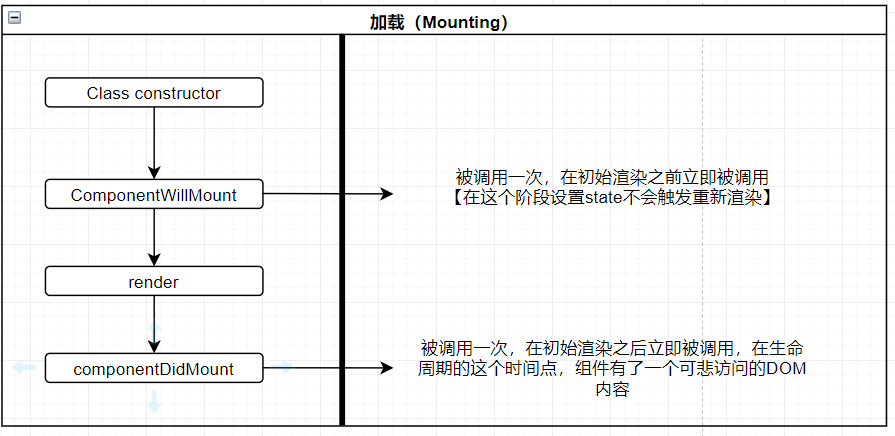
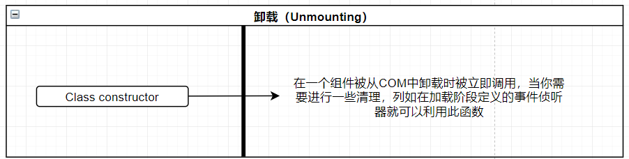
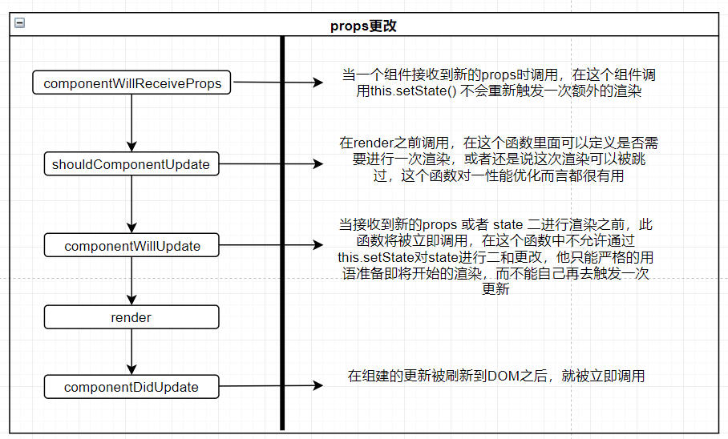
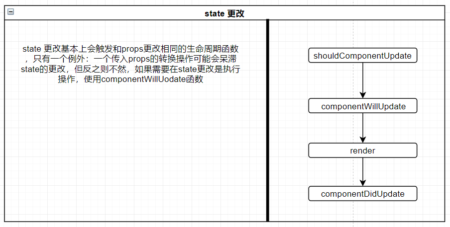
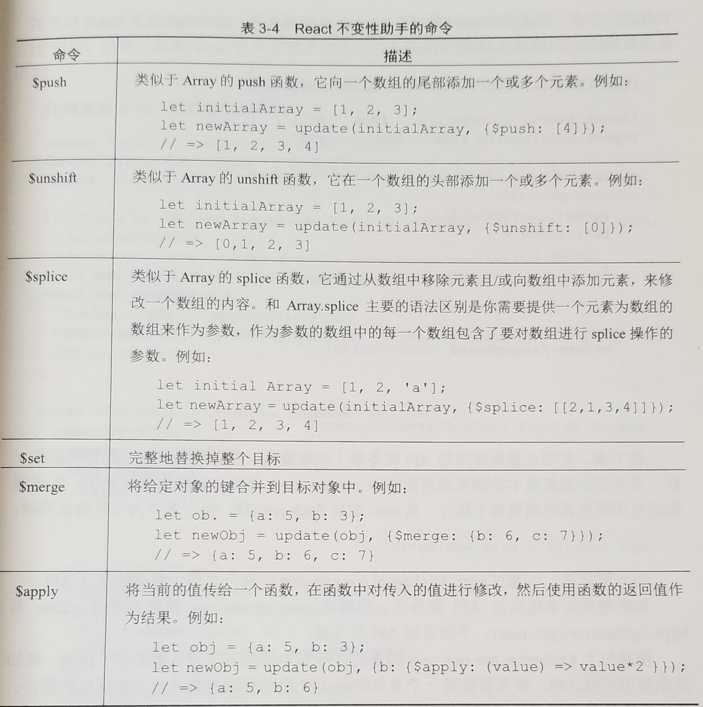

# React 开发实战

## Tips

### 内联样式 自动追加正确的单位

```react
import React, { Component } from 'react'

class StyleSpan extends Component {
  // 可以自动追加正确的单位
  render () {
    let divStyle = {
      width: 100,
      height: 30,
      padding: 5,
      backgroundColor: '#ee9900'
    }

    return (
      <div style={ divStyle }>
        Hello World
      </div>
    )
  }
}


export default StyleSpan
```


### 受控组件和非受控组件

- 受控组件

  ```react
  // 受控组件 值由react 控制
  // 通过handelChangeInput 来更新组件
  < input type="search" value={ this.state.searchTerm } onChange={ e => {
      this.handelChangeInput(e)
    } } />
  ```

- 非受控组

  > 不为react 控制的组件

  ```react
  import React, { Component } from 'react'
  
  class Uncontrolled extends Component {
    constructor () {
      super()
      this.state = {
        name: '赵思',
        email: 'magicwingzs@qq.com'
      }
    }
    handelSubmit (e) {
      e.preventDefault()
      console.dir(e.target.name.value)
      console.dir(e.target.Email.value)
    }
    handelChangeInput (e) {
      console.log(e.target.value)
    }
    render () {
      return (
        <form onSubmit={ this.handelSubmit.bind(this) }>
          <div>
            {/* 通过defaultValue 来设置默认值 */}
            Name: <input name="name" type="text" defaultValue={ this.state.name } onChange={ e => this.handelChangeInput(e) } />
          </div>
          <div>
            Email: <input name="Email" type="email" defaultValue={ this.state.email } />
          </div>
          <button type="submit">
            Submit
          </button>
        </form>
      )
    }
  }
  
  
  export default Uncontrolled
  ```

  

### 自定义propTypes 校验器

```react
import React, { Component } from 'react'
import PropTypes from 'prop-types'

// 自定义的校验器
let titlePropType = (props, propName, componentName) => {
  if (props[propName]) {
    let value = props[propName]
    if (typeof value !== 'string' || value.length > 80) {
      return new Error(
        `${propName} in ${componentName} is longer then 80 characters`
      )
    }
  }
}


class Card extends Component {
  static propTypes = {
    id: PropTypes.number,
    // 使用自定义的校验
    title: titlePropType,
    description: PropTypes.string,
    color: PropTypes.string,
    tasks: PropTypes.arrayOf(PropTypes.object)
  }
  constructor () {
    super()
    this.state = {
    }
  }
  render () {
    return (
      <div className="card">
      </div>
    )
  }
}

export default Card
```

>  验证失败时 

### 组件的生命周期









### 快捷调用传递下来的函数
```react
let tasks = this.props.tasks.map((task, index) => {
      return (
        <li className="checklist__task" key={ task.id }>
          <input type="checkbox" checked={ task.done }
            // 调用传递下来的函数
            onChange={ this.props.taskCallbacks.toggle.bind(null, this.props.cardId, task.id, index) } 
          />
          { task.name }
          {/* 删除任务 */}
          <i className="checklist__task--remove" />
        </li>
      )
    })
```

### 键盘事件 回车事件


## 浅谈不可变性

> 基本概念：我们不去直接修改一个对象，我们直接替换它

### 性能取决

> 比较和检查一个javaScript 对象是否被修改过

如果在对象被修改时，不是直接修改它，而是直接将它替换点，那么查看对象是否被修改就会很快

```react
import React, { Component } from 'react'

class Voucher extends Component {
  constructor () {
    super()
    this.state = {
      passengers: [
        'Simmon, Robert A',
        'Taylor, Kathleen R'
      ],
      ticket: {
        company: 'Dalta',
        filghtNo: '0990',
        departure: {
          airport: 'LAS',
          time: '2016-08-27'
        },
        arrival: {
          airport: 'MIA1',
          time: '2016-08-21'
        },
        codeshare: [
          {
            company: 'GL',
            filghtNo: '9840'
          },
          {
            company: 'TM',
            filghtNo: '5010'
          }
        ]
      }
    }
  }
  render () {
    return (
      <div>
        
      </div>
    )
  }
}


export default Voucher
```

### concat 修改数组

> 假设现在想要将一个新城可添加到passengers 数组中，不小心会直接修改组件的state对象

```react
let updatedPassengers = this.state.passengers;
updatedPassengers.push('Mitchell, Vincent M.')
this.setState({
  passengers: updatedPassengers
})
```

> 创建updatedPassengers并不是创建了一个副本，而是创建了一个新引用
>
> 下面使用Array的concat方法 非入侵式添加了一个新乘客

```react
let updatedPassengers = this.state.passengers.concat('Mitchell, Vincent M.')
this.setState({
  passengers: updatedPassengers
})
```

### Object.assign 修改对象

```javascript
Object.assign(target, source_1, .... , source_n)
// 首先遍历source_1 对象的所有属性 将他们赋值到target 对象上，后面同样操作
```

> 列入要修改ticket 的 flightNo

```react
let updatedTick = Object.assign({}, this.state.ticket, { flightNo: '1010' })
this.setState({
  ticket: updatedTick
})
```

### 嵌套对象

#### 使用不变性助手

```react
npm i react-addons-update -S

import update from 'react-addons-update'
```

> update 接受两个参数 第一个参数是你想要更新的对象或者数组，第二个参数是一个对象，他描述了你想要在何处进行何种修改

```javascript
let student = { name: 'John Caster', grades: { 'A', 'C', 'B' } }

// 数组新增一个元素
// 定位到grader属性 进行push 修改
let newSyudent = update(student, { grades: { $push: ['A'] } })

// 如果想要完全修改整个数组 可以用$set 命令
let newStudent = update(student, { grades: { $set: ['a', 'a', 'b'] } })
```

> 想要修改上面机票对象总的arrival中的airport

```react
let originTicket = {
        company: 'Dalta',
        filghtNo: '0990',
        departure: {
          airport: 'LAS',
          time: '2016-08-27'
        },
        arrival: {
          airport: 'MIA1',
          time: '2016-08-21'
        },
        codeshare: [
          {
            company: 'GL',
            filghtNo: '9840'
          },
          {
            company: 'TM',
            filghtNo: '5010'
          }
        ]
      }

let newTicket = update(originTicket, {
  arrival: {
    airport: { $set: 'MCO' }
  }
})
```



##### 例子

```json
[
    {
        "id": 11977,
        "title": "Read the Book",
        "description": "I should read the **whole** book",
        "color": "#BD8D31",
        "status": "in-progress",
        "tasks": []
    },
    {
        "id": 11978,
        "title": "Write some code",
        "description": "Code along with the samples in the book at [github](https://github.com/pro-react)",
        "color": "#3A7E28",
        "status": "todo",
        "tasks": [
            {
                "id": 42399,
                "name": "ContactList Example",
                "done": true
            },
            {
                "id": 42400,
                "name": "Kanban Example",
                "done": false
            },
            {
                "id": 42401,
                "name": "My own experiments",
                "done": false
            }
        ]
    }
]
```

> 现需要删除某一个card 中的任务列表中某一任务

```react
// 删除任务
  deleteTask (cardId, taskId, taskIndex) {
    // 通过卡片id 拿到 卡片索引
    let cardIndex = this.state.cards.findIndex(card => card.id === cardId)
    // 创建新的副本
    let newCards = update(this.state.cards, {
      // 通过index 定位
      [cardIndex]: {
        // 进行删除操作
        tasks: { $splice: [ [taskIndex, 1] ] }
      }
    })
  }
```

> 操作数组

```javascript
updateCardPosition (cardId, afterId) {
    if (cardId !== afterId) {
      // 获取当前卡片Index
      let cardIndex = this.state.cards.findIndex((card) => card.id === cardId)
      // 获取当前卡片对象
      let card = this.state.cards[cardIndex]

      // 获取下一个列表索引
      let afterIndex = this.state.cards.findIndex((cardId) => card.id == afterId)

      this.setState(update(this.state, {
        cards: {
          $splice: [
            [cardIndex, 1],
            [afterIndex, 0 ,card]
          ]
        }
      }))
    }
```

> 修改对象值

```javascript
updateCardStatus (cardId, listId) {
    // 获取卡片在当前列表的索引
    let cardIndex = this.state.cards.findIndex((card) => card.id === cardId)
    // 获取当前的卡片
    let card = this.state.cards[cardIndex]
    // 如果当前卡片不等于传入的卡片列表的话
    if (card.status !== listId) {
      // 使用不可变性助手、
      this.setState(update(this.state, {
        cards: {
          [cardIndex]: {
            status: {$set: listId}
          }
        }
      }))
    }
  }
```