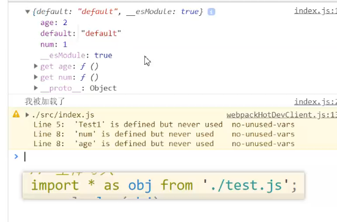
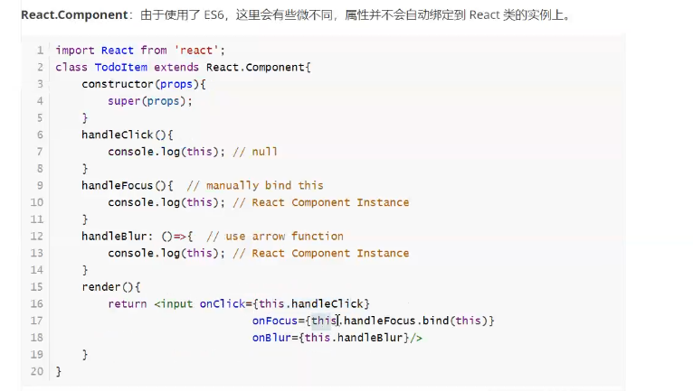
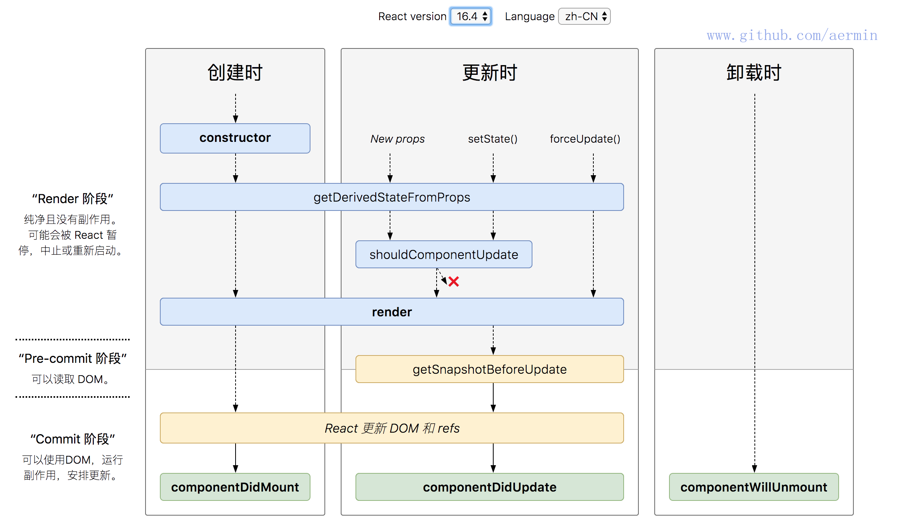
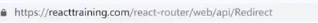
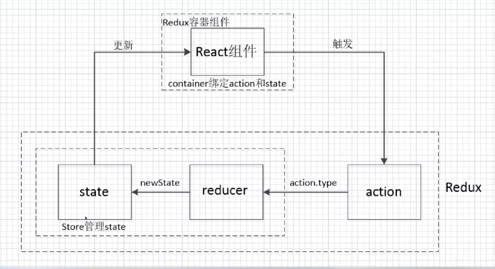
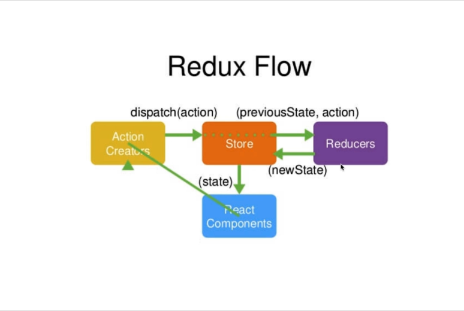
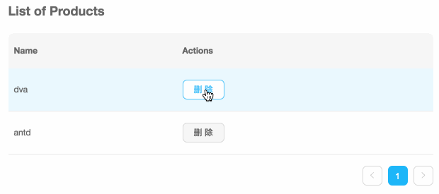

# React

 ## 导入导出

+ import 和 export 都必须放在顶级域
+ import 必须放在script代码最上面

### import 和 require

#### import

**属于加载前置**

> 属于加载前置的机制，因此将其全放在代码顶部，代码逐个解析import获取一个引入的列表，先引入依赖，再去向下执行代码

#### require

**属于加载滞后**

> 代码执行到此行才进行加载

```javascript
if (true) {
	let querStr = require('querStr')
}
```

### 全体导入

> 全体导入进来 使用 * 号， 通过  as 起一个别名



## class

> 使用ES6的class关键字

```javascript
class Obj1 {
    // 静态属性
    // 其中不可能有后面生成的数据
    static staticAge = 999；
    static staticFn = function () {
        console.log(this) // 是Obj1 这个构造函数 
        console.log('静态函数')
    }；
    // 实列属性 
    // 实列可以访问静态属性 因为先有静态
   	myAge = 123;
	myFn () {
        console.log('实列的函数'， this.myAge)
    }
}

let o1 = new Obj1()

```

### 类继承

```javascript
class Person {
	age = 100;
	constructor (props) {
        this.age = props.age
        console,log('先触发父类的构造器')
    }
}

class Boy extents Person {
    name = "zhaosi"
    constructor (props) {
        this.name = props.name
        console.log('后触发子类的类构造器')
    }
}

let boy = new Boy({name: 'zhaosisi', age: 100})
```


## 使用脚手架

### 安装

任意目录全局安装

```javascript
npm i -g create-react-app
```

> 更新npm

```javascript
npm i -g npm to update
```

### 使用

+ create-react-app 项目名 options 构建项目结构
+ cd 项目目录 => npm i 安装依赖

### 运行

+ npm run start 启动
+ npm run build 生成dist

## 基本操作总结

1. 引入React对象
2. 引入ReactDOM对象
3. 操作jsx
   + 

### 组件体验

```javascript
 import React, { Component } from 'react'

class App extends Component {
  // 初始化组件自己的属性
  constructor () {
    super();
    this.state = {
      num: 1
    }
  }
  render () {
    return (
      // 保证一个根节点
      <div>
        我是react
        <hr />
        { this.state.num }
      </div>
    )
  }
}

 export default App

```

#### 双向的输入框数据绑定

##### 写法1

```javascript
import React, { Component } from 'react'

class App extends Component {
  // 初始化组件自己的属性
  constructor () {
    super();
    this.state = {
      num: 1
    }
  }
  changeHandler (e) {
    console.log(e.target.value)
    this.setState({
      num: e.target.value
    })
  }
  render () {
    return (
      // 保证一个根节点
      <div>
        我是react
        <hr />
        { this.state.num }
        <hr/>
        <input value={ this.state.num } onChange={ (e)=>{
          this.changeHandler(e)
        } } />
      </div>
    )
  }
}

 export default App
```

##### 写法2

```javascript
import React, { Component } from 'react'

export class App2 extends Component {
  constructor () {
    super()
    this.state = {
      num: 2
    }
    // 绑定this
    this.changeHandler = this.changeHandler.bind(this)
  }
  changeHandler (e) {
    console.log(e.target.value)
    // 未作处理的情况下 this 为unfined
    console.log(this)
    this.setState({
      num: e.target.value
    })
  }
  render () {
    return (
      <div>
        <span>
          { this.state.num }
          <hr />
          {/* 在{ } 中调用的时候 其实是在顶级域中进行调用 丢死了原有的this */}
          <input type="text" value={ this.state.num } onChange={ this.changeHandler } />
        </span>
      </div>
    )
  }
}
```



### 生命周期




```javascript
class App extends Component {
  constructor () {
    console.log('constructor 1')
    super()
    this.state = {
      num: 1
    }
  }
  // 不推荐发起网络请求 会引起渲染阻塞
  componentWillMount () {
    console.log(' 将要挂载 挂载之前 componentWillMount 2')
  }
  render () {
    console.log('render 3')
    return (
      <div>
        { this.state.num }
        <button onClick={e=>{
          this.setState({
            num: 10
          })
        }}>
          更改数据
        </button>
      </div>
    )
  }
  // 发起网络请求 可能会引起二次render
  componentDidMount () {
    /*
    	这个方法是建立任何订阅 发起网络请求的好地方
    	但应该在卸载的时候取消订阅
    */
    console.log('已经挂载 componentDidMount 4')
  }
  // 控制更新
  shouldComponentUpdate () {
    console.log('控制更新 shouldComponentUpdate')
    // 会在更新之前调用 如果返回true则进行更新 否则不进行更新
    return false
  }
  // 将要更新 更新后触发 render
  componentWillUpdate () {
    console.log('更新之前 将要更新 componentDidUpdate 更新')
  }
  // 参数：之前的属性 数据 快照
  // 更改数据之后才触发
  componentDidUpdate (prevProps, prevState, snapshot) {
    console.log('已经更新 componentDidUpdate 更新')
  }
  // 将要卸载
  componentWillUnmount () {
    console.log(' 卸载之前 componentWillUnmount end')
  }
}

export default App;
```

### 组件传值

#### 父组件传值子组件

**父组件**

```javascript
class App extends React.Component {
  constructor () {
    super()
    this.state = {
      num: 12,
      name: 'zhaosi'
    }
  }
  render () {
    let header = (
                  <div>
                    头部
                  </div>
                 )
    let footer = (
                  <div>
                    底部
                  </div>
                 )
    return (
      <div>
        我是App父组件，以下使用Son组件
        <hr />
        {/* 组件的使用必须首字母大写  */}
        {/* 通过属性传递子组件数据 */}
        {/* 通过变量传递DOM */}
        <Son age={ this.state.num } name={ this.state.name }
            header={ header } footer={ footer }  text={ 11 }
        >
          <ul>
            <li>haha</li>
            <li>kekeke</li>
            <li>hdwdawd</li>
          </ul>
        </Son>
      </div>
    )
  }
}
```

**子组件**

> 内联样式的编写
>
> prop 属性验证

```javascript
import React from 'react'
// 引入传值约束的包
import PropTypes from 'prop-types'

class Son extends React.Component {

  // prop 属性的约定
  static propTypes = {
    text: PropTypes.string.isRequired || Number
  }

  static defaultProps = {
    text: 'abc'
  }

  constructor (props) {
    super(props)
    this.state = {
      num: 1
    }
  }
  render () {
    // 解构赋值 拿到prop中相同属性名的值
    // 声明一个name和age属性，对this.prop中的同名属性进行赋值
    let {age, name, text} = this.props
    console.log('props', this.props)
    return (
      <div>
        我是son 子组件
        <hr />
        { text }
        <hr />
        { age }, {name}
        <hr />
        {/* 传入的底部DOM 内联的样式必须放在 {} 中，然后是一个对象 使用驼峰命名 */}
        <div style={ {backgroundColor: 'red'} }>
          { this.props.header }
        </div>
        
        {/* 必须显示的在子组件中输出 才能显示在父组件中的子组件里slot中的DOM */}
        { this.props.children }

        {/* 传入的头部DOM */}
        <div style={ {backgroundColor: 'green'} }>
          { this.props.header }
        </div>
      </div>
    )
  }
}

export default Son
```

### 混合 包装

#### 包装组件

```react
import React from 'react'

class Son extends React.Component {
  constructor () {
    super()
    this.state = {
      num: 1
    }
  }
  componentDidMount () {
    console.log('son 组件原有的功能')
  }
  render () {
    return (
      <React.Fragment>
        Son 子组件
        <hr />
        { this.state.num }
      </React.Fragment>
    )
  }
}

export default class Wrap extends React.Component {
  constructor () {
    super()
    this.state = {

    }
  }
  componentDidMount () {
    console.log('包装组件中的功能')
  }
  render () {
    return <Son />
  }
}

```

#### 使用包装组件

```react
import React from 'react';
import './App.css';
import Wrap from './son'

function App() {
  return (
    <div className="App">
      <Wrap />>
    </div>
  );
}

export default App;

```

### 路由

#### 使用

##### 安装

+ npm

  ```
  // 在浏览器中使用
  npm i react-router-dom
  ```

+ yarn

  ```
  yarn add react-router-dom
  ```

##### 基本使用

> 

```react
import React from 'react';
import './App.css';
// 专门用来给浏览器使用的
import {HashRouter, BrowserRouter as Router, Route,
NavLink, Switch, Redirect} from 'react-router-dom'

class User extends React.Component {
  componentDidMount () {
    // 获取id
    // 第一种方式获取
    console.log(this.props.match.params.id)
    console.log(this.props)
  }
  render () {
    return (
      <div>
        <h1>
          用户组件
          <button onClick={ e=> {
            this.props.history.goBack()
          } }>
            后退 前进
          </button>
        </h1>
      </div>
    )
  }
}

class Man extends React.Component {
  render () {
    return (
      <div>
        <h3>男人</h3>
      </div>
    )
  }
}

class Woman extends React.Component {
  render () {
    return (
      <div>
        <h3>女人</h3>
      </div>
    )
  }
}

class Home extends React.Component {
  render () {
    return (
      <div>
        <h1>
          我是首页
        </h1>
        <h2>以下是可变内容</h2>
        {/* 嵌套路由必须写完整路径 */}
        {/* 相同路由造成横向的重复匹配
            会同时出现 “男人”， “女人”
        */}
        <Switch>
          {/* 使用Switch 只匹配一个 */}
          <Route path="/a/man" component={ Man } />
          <Route path="/a/man" component={ Woman } />
          <Route path="/a/woman" component={ Woman } />
        </Switch>
      </div>
    )
  }
}


class App extends React.Component {
  render () {
    let  pathObj1  = {
      pathname: '/user/4',
    }

    let  pathObj2_userq  = {
      pathname: '/userq',
      search: '?id=11',
      state: {name: 'zhaosi'},
      query: {sex: '000'}
    }
    return (
      <div className="App">
        <h1> 头部 </h1>

        {/* Router 相当于规则和坑  */}
        <Router>
          {/* 因为Router 只能有一个子节点 */}
          <React.Fragment>
            <NavLink to="/a/man" activestyle={{ color: '#4dco60' }}>
              男
            </NavLink>
            <NavLink to="/a/woman" activeClassName="selected">
              女
            </NavLink>

            {/* 第一种传参方式 params 直接写路由 */}
            <NavLink to="/user/10" activeClassName="selected">
              去user 字符串传
            </NavLink>
            <NavLink to={ pathObj1 } activeClassName="selected">
              去user 对象方式穿
            </NavLink>

            {/* 第二种方式 query */}
            <NavLink to="/userq?id=1" activeClassName="selected">
              去userq 字符串传
            </NavLink>
            {/* 在this.props.location 传 */}
            <NavLink to={ pathObj2_userq } 					       activeClassName="selected">
              去userq 对象传
            </NavLink>
            <Switch>
              {/* 模糊匹配 只要以/开头的路由都会匹配到 
                  如果不加 exact(精确匹配) 路由为 “/a时”会出现两个 “首页” 
              */}
              <Route path="/" exact component={ Home } />
              {/* 需要有嵌套路由的 不能使用exact */}
              <Route path="/a" component={ Home } />

              {/* 传递参数 路由参数 传递字符串 */}
              <Route path="/user/:id" component={ User } />
            
              <Route path="/userq" component={ User } />
              {/* 重定向 */}
              <Redirect to="/" />
            </Switch>
          </React.Fragment>
        </Router>

        <h1> 底部 </h1>
      </div>
    )
  }
}

export default App;

```

+ exact

  > 精确匹配（必须精确匹配到path的字符串）
  >
  > 纵向深入匹配
  >
  > 有嵌套路由的 不能使用exact 进行精确匹配

+ switch

  > 横向匹配 选择一个
  >
  > 被包裹的<Route />
  >
  > 从上到下进行匹配

# Redux






> 

## 安装

```react
npm i redux react-redux -S
```

## 使用

1. 新建actions目录

   > 存放发出的actions 指令

   + 新建一个user指令集文件 来更新store 中 user 的数据

     ```react
     --actions
     	--user.js
     // 定义的常量文件
     import * as userConstants from '../constants/user'
     
     /*
      * actions 就是一条对象信息 带着一些描述
      action 发完 会给到 reducers里
      */
     
     /**
      * 运行login 同时把需要的数据传递进去
      * 然后其会返回一个对象 对象会带着type的信息 作用始位了USER_LOGIN
      * type 就是 action 的名字
      * @param {*} payload 发出action带上的参数
      */
     export const login =  (payload) => {
       return {
         type: userConstants.USER_LOGIN,
         payload
       }
     }
     
     // 发出指令退出
     export const logout =  (payload) => {
       return {
         type: userConstants.USER_LOGOUT,
         payload
       }
     }
     
     // 发出指令 进行登录
     export const update =  (payload) => {
       return {
         type: userConstants.USER_UPDATE,
         payload
       }
     }
     ```

2. reducers

   > 收到actions 指令 对数据进行处理 产生新的state数据

   + 新建user.js 对应指令集发来的指令进行处理

     ```react
     --reducers
     	--user.js
     	--index.js
     
     import * as userConstants from '../constants/user'
     
     /**
      * 识别发来的action 是干什么的action
      * @param {*} state 
      * @param {*} action 
      */
     export default function (state = {}, action) {
       switch (action.type) {
         // 在匹配到了一个action 的时候 需要返回一个新的数据
         case userConstants.USER_LOGIN: 
           return {
             ...state,
             ...action.payload,
             isLoading: true
           }
     
         case userConstants.USER_LOGOUT: 
           return {
             isLoading: false
           }
     
         case userConstants.USER_UPDATE: 
           return {
             ...state,
             ...action.payload,
             isLoading: true
           }
     
         // 必须有个默认值 
         default: {
           // console.log(state)
           return {
             ...state
           }
         }
       }
     }
     ```

   + 新建index.js 合并reducers中的处理指令中的文件

     ```react
     // 导入用于合并的方法
     import { combineReducers }  from 'redux'
     
     import user from './user'
     import city from './city'
     
     // 存在多个reducers 合并以下
     export default combineReducers({
       user,
       // city, 如果存在此文件，则进行合并
     })
     ```

3. store

   > 存放数据和状态

   + 新建index,js 

     ```react
     /* 
       全局只有一个store
     */
     import { createStore } from 'redux'
     // 拿到合并的reducers
     import reducer from '../reducers'
     
     /**
      * 通过函数去创建store
      * @param {*} initStroe 
      */
     export default function Store (initStroe) {
       return createStore(reducer, initStroe)
     }
     ```

4. constants

   > 因为actions 需要写一个名字
   >
   > reducers 需要匹配一个名字
   >
   > 这两个名字会在两个对方用到，重复出现的单独抽出来
   
   + 新建 对应 actions 中user指令集的常量文件
   
     ```react
     --constants
        --user.js
     /**
      * 常量定义
      */
     export const USER_LOGIN = 'USER_LOGIN'
     export const USER_LOGOUT = 'USER_LOGOUT'
     export const USER_UPDATE = 'USER_UPDATE'
     ```
   
5. index.js

   ```react
   // 引入创建好的store方法
   import Store from './store'
   // 引入包装的组件 
   import { Provider } from 'react-redux'
   
   // 初始化一个store
   const store = Store({
     user: {
       isLoading: false
     },
     city: {
       '024': '西安'
     }
   })
   
   ReactDOM.render(
     //  传入store
     <Provider store = { store}>
       <App />
     </Provider>,
     document.getElementById('root')
   );
   ```

6. 在组件中使用 列如在App.js 中使用

   ```react
   import React from 'react';
   import { connect } from 'react-redux'
   import logo from './logo.svg';
   // 使用action
   import * as userAction from './actions/user'
   import './App.css';
   
   class App extends React.Component {
     render () {
       console.log(this.props)
   
       // 直接通过props 进行获取 因为就是通过props传入的
       const { user } = this.props
   
       return (
         <div className="App">
           <header className="App-header">
             
             <div>
               {
                 user.isLoading ? 
                   '欢迎您'
                   :
                   '未登录'
               }
             </div>
             <button onClick={ e=> {
               this.props.dispatch(
                 userAction.login({
                   account: 'test',
                   password: '123'
                 })
               )
             } }>
               登录
             </button>
           </header>
         </div>
       );
     }
   }
   
   // 一个页面可能不需要用到这么多的全局数据
   // 从所有的仓库数据中拿到所需要的数据
   // function mapStateToProps (state) {
   //   return {
   //     state: state.user
   //   }
   // }
   
   /**
    * 运行后会生成一个新的方法 把APP传入新方法中
    */
   // export default connect(mapStateToProps)(App);
   
   // 这里的命名决定了在props中的取值名字
   export default connect((state) => {
     return {
       user: state.user
     }
   })(App)
   
   ```

### 使用redux-thunk

```react
/* 
  全局只有一个store
*/
// 1、引用 applyMiddleware, compose 
import { createStore, applyMiddleware, compose } from 'redux'

// 2、安装引用 -S
// 使用redux-thunk+
import thunkMiddleware from 'redux-thunk'

// 拿到合并的reducers
import reducer from '../reducers'

/**
 * 通过函数去创建store
 * @param {*} initStroe 
 */
export default function Store (initStroe) {
  // 3、注册中间件 拦截actions 的发出
  // 第三个参数做一些扩展的处理
  return createStore(
    reducer,
    initStroe,
    compose(applyMiddleware(thunkMiddleware)),
    window._REDUX_DEVTOOLS_EXTENSION_ && window._REDUX_DEVTOOLS_EXTENSION_()
  )
}
```

在 action.js 中使用

```react
import * as userConstants from '../constants/user'

/*
 * actions 就是一条对象信息 带着一些描述
 action 发完 会给到 reducers里
 */

/**
 * 运行login 同时把需要的数据传递进去
 * 然后其会返回一个对象 对象会带着type的信息 作用始位了USER_LOGIN
 * type 就是 action 的名字
 * @param {*} payload 发出action带上的参数
 */

 const loginApi = () => {
   return new Promise ((resolve) => {
     setTimeout(() => {
       resolve({
        isLoading: true,
        nickname: 'zhaosi',
        avatar: 'http://baidu.com'
       })
     }, 3000)
   })
 }

export const login =  (payload) => {

  // 第四版
  return async (dispatch) => {
    dispatch(update({ 
      loading: true 
    }))

    const res = await loginApi()
    console.log('res', res)
    
    dispatch(update({
      ...res,
      loading: false
    }))
  }


  // 第二版
  // 因为thunk 拦截了 actions ，会传入一个 dispatch 回来
  // return (dispatch) => {
  //   setTimeout(
  //     dispatch(
  //       update({
  //         isLoading: true,
  //         nickname: 'zhaosi',
  //         avatar: 'http://baidu.com'
  //       }))
  //   , 3000)
  // }


  // 第一版
  // return {
  //   type: userConstants.USER_LOGIN,
  //   payload
  // }
}

export const logout =  (payload) => {
  return {
    type: userConstants.USER_LOGOUT,
    payload
  }
}

export const update =  (payload) => {
  console.log('update')
  return {
    type: userConstants.USER_UPDATE,
    payload
  }
}
```

# dva

## 安装 dva-cli

通过 npm 安装 dva-cli 并确保版本是 `0.9.1` 或以上。

```bash
$ npm install dva-cli -g
$ dva -v
dva-cli version 0.9.1
```

## [#](https://dvajs.com/guide/getting-started.html#创建新应用)创建新应用

安装完 dva-cli 之后，就可以在命令行里访问到 `dva` 命令（[不能访问？](http://stackoverflow.com/questions/15054388/global-node-modules-not-installing-correctly-command-not-found)）。现在，你可以通过 `dva new` 创建新应用。

```bash
$ dva new dva-quickstart
```

这会创建 `dva-quickstart` 目录，包含项目初始化目录和文件，并提供开发服务器、构建脚本、数据 mock 服务、代理服务器等功能。

然后我们 `cd` 进入 `dva-quickstart` 目录，并启动开发服务器：

```bash
$ cd dva-quickstart
$ npm start
```

几秒钟后，你会看到以下输出：

```bash
Compiled successfully!

The app is running at:

  http://localhost:8000/

Note that the development build is not optimized.
To create a production build, use npm run build.
```

在浏览器里打开 http://localhost:8000 ，你会看到 dva 的欢迎界面。

## [#](https://dvajs.com/guide/getting-started.html#使用-antd)使用 antd

通过 npm 安装 `antd` 和 `babel-plugin-import` 。`babel-plugin-import` 是用来按需加载 antd 的脚本和样式的，详见 [repo](https://github.com/ant-design/babel-plugin-import) 。

```bash
$ npm install antd babel-plugin-import --save
```

编辑 `.webpackrc`，使 `babel-plugin-import` 插件生效。

```diff
{
+  "extraBabelPlugins": [
+    ["import", { "libraryName": "antd", "libraryDirectory": "es", "style": "css" }]
+  ]
}
```

> 注：dva-cli 基于 roadhog 实现 build 和 dev，更多 `.webpackrc` 的配置详见 [roadhog#配置](https://github.com/sorrycc/roadhog#配置)

## [#](https://dvajs.com/guide/getting-started.html#定义路由)定义路由

我们要写个应用来先显示产品列表。首先第一步是创建路由，路由可以想象成是组成应用的不同页面。

新建 route component `routes/Products.js`，内容如下：

```javascript
import React from 'react';

const Products = (props) => (
  <h2>List of Products</h2>
);

export default Products;
```

添加路由信息到路由表，编辑 `router.js` :

```diff
+ import Products from './routes/Products';
...
+ <Route path="/products" exact component={Products} />
```

然后在浏览器里打开 http://localhost:8000/#/products ，你应该能看到前面定义的 `<h2>` 标签。

## [#](https://dvajs.com/guide/getting-started.html#编写-ui-component)编写 UI Component

随着应用的发展，你会需要在多个页面分享 UI 元素 (或在一个页面使用多次)，在 dva 里你可以把这部分抽成 component 。

我们来编写一个 `ProductList` component，这样就能在不同的地方显示产品列表了。

新建 `components/ProductList.js` 文件：

```javascript
import React from 'react';
import PropTypes from 'prop-types';
import { Table, Popconfirm, Button } from 'antd';

const ProductList = ({ onDelete, products }) => {
  const columns = [{
    title: 'Name',
    dataIndex: 'name',
  }, {
    title: 'Actions',
    render: (text, record) => {
      return (
        <Popconfirm title="Delete?" onConfirm={() => onDelete(record.id)}>
          <Button>Delete</Button>
        </Popconfirm>
      );
    },
  }];
  return (
    <Table
      dataSource={products}
      columns={columns}
    />
  );
};

ProductList.propTypes = {
  onDelete: PropTypes.func.isRequired,
  products: PropTypes.array.isRequired,
};

export default ProductList;
```

## [#](https://dvajs.com/guide/getting-started.html#定义-model)定义 Model

完成 UI 后，现在开始处理数据和逻辑。

dva 通过 model 的概念把一个领域的模型管理起来，包含同步更新 state 的 reducers，处理异步逻辑的 effects，订阅数据源的 subscriptions 。

新建 model `models/products.js` ：

```javascript
export default {
  namespace: 'products',
  state: [],
  reducers: {
    'delete'(state, { payload: id }) {
      return state.filter(item => item.id !== id);
    },
  },
};
```

这个 model 里：

- `namespace` 表示在全局 state 上的 key
- `state` 是初始值，在这里是空数组
- `reducers` 等同于 redux 里的 reducer，接收 action，同步更新 state

然后别忘记在 `index.js` 里载入他：

```diff
// 3. Model
+ app.model(require('./models/products').default);
```

## [#](https://dvajs.com/guide/getting-started.html#connect-起来)connect 起来

到这里，我们已经单独完成了 model 和 component，那么他们如何串联起来呢?

dva 提供了 connect 方法。如果你熟悉 redux，这个 connect 就是 react-redux 的 connect 。

编辑 `routes/Products.js`，替换为以下内容：

```javascript
import React from 'react';
import { connect } from 'dva';
import ProductList from '../components/ProductList';

const Products = ({ dispatch, products }) => {
  function handleDelete(id) {
    dispatch({
      type: 'products/delete',
      payload: id,
    });
  }
  return (
    <div>
      <h2>List of Products</h2>
      <ProductList onDelete={handleDelete} products={products} />
    </div>
  );
};

// export default Products;
export default connect(({ products }) => ({
  products,
}))(Products);
```

最后，我们还需要一些初始数据让这个应用 run 起来。编辑 `index.js`：

```diff
- const app = dva();
+ const app = dva({
+   initialState: {
+     products: [
+       { name: 'dva', id: 1 },
+       { name: 'antd', id: 2 },
+     ],
+   },
+ });
```

刷新浏览器，应该能看到以下效果：



## [#](https://dvajs.com/guide/getting-started.html#构建应用)构建应用

完成开发并且在开发环境验证之后，就需要部署给我们的用户了。先执行下面的命令：

```bash
$ npm run build
```

几秒后，输出应该如下：

```bash
> @ build /private/tmp/myapp
> roadhog build

Creating an optimized production build...
Compiled successfully.

File sizes after gzip:

  82.98 KB  dist/index.js
  270 B     dist/index.css
```

`build` 命令会打包所有的资源，包含 JavaScript, CSS, web fonts, images, html 等。然后你可以在 `dist/` 目录下找到这些文件。