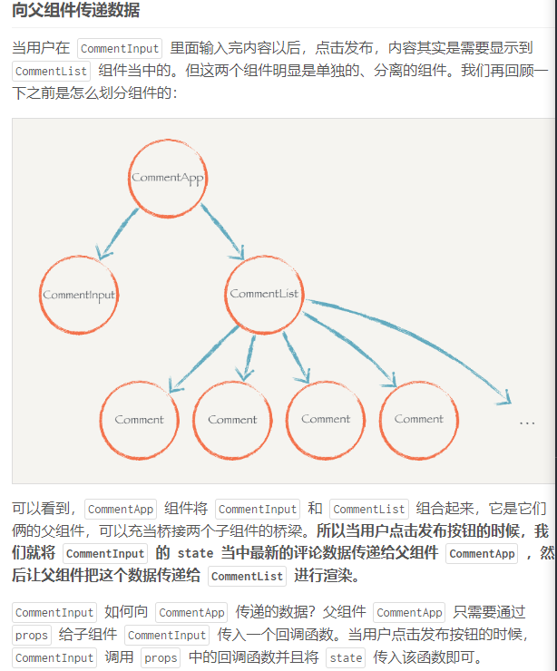

# React 小书

## 基本环境

1. 安装node

   > 修改node镜像

   ```
   npm config set registry https://registry.npm.taobao.org
   ```

2. 全局安装脚手架

   ```javascript
   npm install -g create-react-app
   ```

3. 通过脚手架命令新建工程

   ```javascript
   create-react-app hello-react
   ```

## 使用JSX描述UI信息

### JSX 原理

```javascript
<div class='box' id='content'>
  <div class='title'>Hello</div>
  <button>Click</button>
</div>
```

> 每个DOM元素的结构都可以用javaScript的对象来表示，一个DOM元素包含的信息其实包含三个
>
> 1. 标签名
> 2. 属性
> 3. 子元素

**用JavaScript 来表示**

```javascript
{
  tag: 'div',
  attrs: { className: 'box', id: 'content'},
  children: [
    {
      tag: 'div',
      arrts: { className: 'title' },
      children: ['Hello']
    },
    {
      tag: 'button',
      attrs: null,
      children: ['Click']
    }
  ]
}
```


> ，为什么不直接从 JSX 直接渲染构造 DOM 结构，而是要经过中间这么一层呢？
>
> 第一个原因是，当我们拿到一个表示 UI 的结构和信息的对象以后，不一定会把元素渲染到浏览器的普通页面上，我们有可能把这个结构渲染到 canvas 上，或者是手机 App 上。所以这也是为什么会要把 `react-dom` 单独抽离出来的原因，可以想象有一个叫 `react-canvas` 可以帮我们把 UI 渲染到 canvas 上，或者是有一个叫 `react-app` 可以帮我们把它转换成原生的 App（实际上这玩意叫 `ReactNative`）。
>
> 第二个原因是，有了这样一个对象。当数据变化，需要更新组件的时候，就可以用比较快的算法操作这个 JavaScript 对象，而不用直接操作页面上的 DOM，这样可以尽量少的减少浏览器重排，极大地优化性能。这个在以后的章节中我们会提到。

## 组件的render 方法

+ 编写React.js组件的时候，需要继承React的Component 

+ 一个组建磊必须要实现一个render 方法，这个方法必须要返回一个JSX元素

  > 必须是一个根节点

### 表达式插入

> 注意，直接使用 `class` 在 React.js 的元素上添加类名如 `<div class=“xxx”>` 这种方式是不合法的。因为 `class` 是 JavaScript 的关键字，所以 React.js 中定义了一种新的方式：`className` 来帮助我们给元素添加类名。
>
> 还有一个特例就是 `for` 属性，例如 `<label for='male'>Male</label>`，因为 `for` 也是 JavaScript 的关键字，所以在 JSX 用 `htmlFor` 替代，即 `<label htmlFor='male'>Male</label>`。而其他的 HTML 属性例如 `style` 、`data-*` 等就可以像普通的 HTML 属性那样直接添加上去。

### 条件返回

```
{
          isGoodWord ? <span>在条件渲染中我是真的返回</span> : <span>在条件渲染中我是假的返回</span>
}
```

> 如果你在表达式插入里面返回 `null` ，那么 React.js 会什么都不显示，相当于忽略了该表达式插入。结合条件返回的话，我们就做到显示或者隐藏某些元素：

```
...
render () {
  const isGoodWord = true
  return (
    <div>
      <h1>
        React 小书
        {isGoodWord
          ? <strong> is good</strong>
          : null
        }
      </h1>
    </div>
  )
}
```

### JSX 变量

> 理解 JSX 元素就是 JavaScript 对象。那么你就可以联想到，JSX 元素其实可以像 JavaScript 对象那样自由地赋值给变量，或者作为函数参数传递、或者作为函数的返回值。

```
render () {
	let workKey = '我是表达式插入的(换不换行都不影响我)'
  const isGoodWord = true
  const goodWord = <strong> is good{ workKey }</strong>
  const badWord = <span> is not good</span>
  return (
    <div>
      <h1>
        React 小书
        {isGoodWord ? goodWord : badWord}
      </h1>
    </div>
  )
}
```

## 事件监听

> 在 React.js 不需要手动调用浏览器原生的 `addEventListener` 进行事件监听。React.js 帮我们封装好了一系列的 `on*` 的属性

> *这些 on\* 的事件监听只能用在普通的 HTML 的标签上，而不能用在组件标签上*。也就是说，`<Header onClick={…} />` 这样的写法不会有什么效果的。这一点要注意，但是有办法可以做到这样的绑定，以后我们会提及。现在只要记住一点就可以了：这些 `on*` 的事件监听只能用在普通的 HTML 的标签上，而不能用在组件标签上。

### event 对象

> 事件监听函数会被自动传入一个 `event` 对象

### 关于事件中的this

> 一般在某个类的实例方法里面的 `this` 指的是这个实例本身。但是你在上面的 `handleClickOnTitle` 中把 `this` 打印出来，你会看到 `this` 是 `null` 或者 `undefined`

```
...
  handleClickOnTitle (e) {
    console.log(this) // => null or undefined
  }
...
```

这是因为 React.js 调用你所传给它的方法的时候，并不是通过对象方法的方式调用（`this.handleClickOnTitle`），而是直接通过函数调用 （`handleClickOnTitle`），所以事件监听函数内并不能通过 `this` 获取到实例。

如果你想在事件函数当中使用当前的实例，你需要手动地将实例方法 `bind` 到当前实例上再传入给 React.js。

```javascript
class Title extends Component {
  handleClickOnTitle (e) {
    console.log(this)
  }

  render () {
    return (
      // 如果需要传递参数的话
      <h1 onClick={this.handleClickOnTitle.bind(this, 'Hello')}>React 小书</h1>
    )
  }
}
```

## 组件的 state和setState 

### setState 接受函数参数

> 你调用 `setState` 的时候，*React.js 并不会马上修改 state*。而是把这个对象放到一个更新队列里面，稍后才会从队列当中把新的状态提取出来合并到 `state` 当中，然后再触发组件更新。

```
...
  handleClickOnLikeButton () {
    console.log(this.state.isLiked)   false
    this.setState({
      isLiked: !this.state.isLiked
    })
    console.log(this.state.isLiked)   false
  }
...
```

> 两次打印都是false ，即使我们中间已经setState过一次了
>
> 如果你想在setState之后使用新的state来做后续运算就做不到

```
...
  handleClickOnLikeButton () {
    this.setState({ count: 0 }) // => this.state.count 还是 undefined
    this.setState({ count: this.state.count + 1}) // => undefined + 1 = NaN
    this.setState({ count: this.state.count + 2}) // => NaN + 2 = NaN
  }
...
```

最终的结果是NaN ,setState 不能立即进行修改

#### setState的第二种使用方式

> 可以接受一个函数作为参数， React会把上一个setState的结果传入这个函数，可以使用此结果进行运算、操作、然后返回一个对象作为更新state的对象

```
...
  handleClickOnLikeButton () {
    this.setState((prevState) => {
      return { count: 0 }
    })
    this.setState((prevState) => {
      return { count: prevState.count + 1 } // 上一个 setState 的返回是 count 为 0，当前返回 1
    })
    this.setState((prevState) => {
      return { count: prevState.count + 2 } // 上一个 setState 的返回是 count 为 1，当前返回 3
    })
    // 最后的结果是 this.state.count 为 3
  }
...
```

##### setState 合并

> 多次进行setState不会带来性能问题

进行了三次setState， 但是实际上组件只会重新渲染一次，而不是三次

**因为在React.js内部会把JavaScript事件循环中的消息队列同一个消息中的setState都进行合并以后再重新渲染组件**

## 配置组件的props

### 向组件内部传入函数作为参数

```
class Index extends Component {
  render () {
    return (
      <div>
        <LikeButton
          wordings={{likedText: '已赞', unlikedText: '赞'}}
          onClick={() => console.log('Click on like button!')}/>
      </div>
    )
  }
}
```

> 可以通过this.props.onClick方法获取到这个传进来的函数

修改一下组件onClick时触发的函数为

```
...
  handleClickOnLikeButton () {
    this.setState({
      isLiked: !this.state.isLiked
    })
    // 在每次点击组件时触发handleClickOnLikeButton 判断是否传入onClick方法
    // 如果传入了 则进行调用
    if (this.props.onClick) {
      this.props.onClick()
    }
  }
...
```

### 默认配置 defaultProps

```javascript
class LikeButton extends Component {
  // 加上了如下代码 
  static defaultProps = {
    likedText: '取消',
    unlikedText: '点赞'
  }

  constructor () {
    super()
    this.state = { isLiked: false }
  }

  handleClickOnLikeButton () {
    this.setState({
      isLiked: !this.state.isLiked
    })
  }

  render () {
    return (
      <button onClick={this.handleClickOnLikeButton.bind(this)}>
        {this.state.isLiked
          ? this.props.likedText
          : this.props.unlikedText} 👍
      </button>
    )
  }
}
```

### propTypes 和 组件参数验证

#### 安装

```
npm install --save prop-types
```

#### 使用

```react
import React, { Component } from 'react'
import PropTypes from 'prop-types'

class Comment extends Component {
  static propTypes = {
    comment: PropTypes.object
  }

  render () {
    const { comment } = this.props
    return (
      <div className='comment'>
        <div className='comment-user'>
          <span>{comment.username} </span>：
        </div>
        <p>{comment.content}</p>
      </div>
    )
  }
}
```

```
PropTypes.array
PropTypes.bool
PropTypes.func
PropTypes.number
PropTypes.object
PropTypes.string
PropTypes.node
PropTypes.element
```

### 函数式组件验证

```react
import React from 'react'
import PropTypes from 'prop-types'
import Comment from './Comment'

function CommentList ({ comments = [], onDeleteComment }) {
  return (
    <div>
      {
        comments.map((item, index) => {
          return <Comment comment = { item } key = {index} />
        } )
      }
    </div>
  )
}

CommentList.propTypes  = {
  comments: PropTypes.array.isRequired,
  onDeleteComment: PropTypes.func.isRequired
}

export default CommentList
```

```react
const Text = ({ children }) => 
  <p>{children}</p>
Text.propTypes = { children: React.PropTypes.string };
Text.defaultProps = { children: 'Hello World!' };
```

### props 不可变

> props 一旦传进来就不能改变

> 你不能改变一个组件被渲染的时候传进来的 `props`。React.js 希望一个组件在输入确定的 `props` 的时候，能够输出确定的 UI 显示形态。如果 `props`渲染过程中可以被修改，那么就会导致这个组件显示形态和行为变得不可预测，这样会可能会给组件使用者带来困惑。

**但这并不意味着由props决定的显示形态不能被修改 组件的使用者可以主动的通过重新渲染的方式 把新的props传入组件当中**

> 通过父组件主动重新渲染的方式来传入新的props，从而达到更新的效果

```react
class Index extends Component {
  constructor () {
    super()
    this.state = {
      likedText: '已赞',
      unlikedText: '赞'
    }
  }

  handleClickOnChange () {
    this.setState({
      likedText: '取消',
      unlikedText: '点赞'
    })
  }

  render () {
    return (
      <div>
      // 把state中的属性传入子组件
        <LikeButton
          likedText={this.state.likedText}
          unlikedText={this.state.unlikedText} />
        <div>
          // 当点击父组件的button时 修改state中的属性 从而修改了子组件中传入的
          // props
          <button onClick={this.handleClickOnChange.bind(this)}>
            修改 wordings
          </button>
        </div>
      </div>
    )
  }
}
```

## 给父组件传递数据



## state 和 props 的总结

### state

> 设置了state的叫做有状态组件

+ state 的主要作用是用于组件保存、控制、修改**自己**的可变状态
+ 可以认为state是一个局部的，只能被组件自身控制的
+ state中状态可以通过this.setState方法进行更新，setState会导致组件的重新渲染

### props

> 没有state的组件叫做无状态组件

+ props的蛀牙偶哦用时让使用该组件的父组件可以传入参数来配置该组件，他是外部传进来的配置参数
+ 租金啊内部无法控制也无法修改，除非外部组件竹筒传入新的props，否则组件的props永远保持不变

## 列表渲染数据

### 渲染存放JSX元素的数组

## 挂载阶段的组件生命周期（一）

> React.js 组件渲染，并且构建DOM元素然后塞入页面的过程称为组件的挂载

React.js 将组件渲染，并且构造 DOM 元素然后塞入页面的过程称为组件的挂载。这一节我们学习了 React.js 控制组件在页面上挂载和删除过程里面几个方法：

- `componentWillMount`：组件挂载开始之前，也就是在组件调用 `render` 方法之前调用。
- `componentDidMount`：组件挂载完成以后，也就是 DOM 元素已经插入页面后调用。
- `componentWillUnmount`：组件对应的 DOM 元素从页面中删除之前调用。

```
-> constructor()
-> componentWillMount()
-> render()
// 然后构造 DOM 元素插入页面
-> componentDidMount()
```

## 更新阶段的组件生命周期

1. `shouldComponentUpdate(nextProps, nextState)`：你可以通过这个方法控制组件是否重新渲染。如果返回 `false` 组件就不会重新渲染。这个生命周期在 React.js 性能优化上非常有用。
2. `componentWillReceiveProps(nextProps)`：组件从父组件接收到新的 `props` 之前调用。
3. `componentWillUpdate()`：组件开始重新渲染之前调用。
4. `componentDidUpdate()`：组件重新渲染并且把更改变更到真实的 DOM 以后调用。

## ref 和 React.js 中的DOM操作

```
class AutoFocusInput extends Component {
  componentDidMount () {
    this.input.focus()
  }

  render () {
    return (
    // 元素在页面挂载完以后，就会调用此函数 传递DOM实列给Input 然后自动获取focus()
      <input ref={(input) => this.input = input} />
    )
  }
}

ReactDOM.render(
  <AutoFocusInput />,
  document.getElementById('root')
)
```

## dangerouslySetHTML 和 style 属性

### dangerouslySetHTML （动态的插入HTML元素）

表达式插入并不会把一个 `<h1>` 渲染到页面，而是把它的文本形式渲染了。那要怎么才能做到设置动态 HTML 结构的效果呢？React.js 提供了一个属性 `dangerouslySetInnerHTML`，可以让我们设置动态设置元素的 innerHTML：

```javascript
...
  render () {
    return (
      <div
        className='editor-wrapper'
        dangerouslySetInnerHTML={{__html: this.state.content}} />
    )
  }
...
```

### style

React.js 中的元素的 `style` 属性的用法和 DOM 里面的 `style` 不大一样，普通的 HTML 中的：

```html
<h1 style='font-size: 12px; color: red;'>React.js 小书</h1>
```

在 React.js 中你需要把 CSS 属性变成一个对象再传给元素：

```html
<h1 style={{fontSize: '12px', color: 'red'}}>React.js 小书</h1>
```

`style` 接受一个对象，这个对象里面是这个元素的 CSS 属性键值对，原来 CSS 属性中带 `-` 的元素都必须要去掉 `-` 换成驼峰命名，如 `font-size` 换成 `fontSize`，`text-align` 换成 `textAlign`。

用对象作为 `style` 方便我们动态设置元素的样式。我们可以用 `props` 或者 `state` 中的数据生成样式对象再传给元素，然后用 `setState` 就可以修改样式，非常灵活：

```html
<h1 style={{fontSize: '12px', color: this.state.color}}>React.js 小书</h1>
```

只要简单地 `setState({color: 'blue'})` 就可以修改元素的颜色成蓝色。

## 组件的命名方法和摆放顺序

+ 组件的私有方法都用`—`开头

+ 事件监听的方法都用`handle`方法开头

+ 把事件监听方法传给组件的时候，属性名用`on`开头

  > <CommentInput
  > onSubmit={this.handleSubmitComment.bind(this)} />

### 组件的内容编写顺序

1. static 开头的类属性，如 `defaultProps`、`propTypes`。
2. 构造函数，`constructor`。
3. getter/setter（还不了解的同学可以暂时忽略）。
4. 组件生命周期。
5. `_` 开头的私有方法。
6. 事件监听方法，`handle*`。
7. `render*`开头的方法，有时候 `render()` 方法里面的内容会分开到不同函数里面进行，这些函数都以 `render*` 开头。
8. `render()` 方法。

## 高阶组件

> 高阶组件就是一个函数，传给他一个组件，它返回一个新的组件

