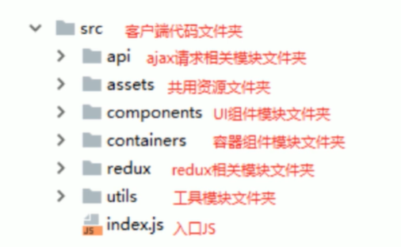

# 硅谷直聘

## 目录的初始配置



## 使用antd-mobile

### 安装

```javascript
npm i antd-mobile -S
```

### 引入模板

```javascript
<!DOCTYPE html>
<html>
<head>
  <!-- set `maximum-scale` for some compatibility issues -->
  <meta name="viewport" content="width=device-width, initial-scale=1, maximum-scale=1, minimum-scale=1, user-scalable=no" />
  <script src="https://as.alipayobjects.com/g/component/fastclick/1.0.6/fastclick.js"></script>
  <script>
    if ('addEventListener' in document) {
      document.addEventListener('DOMContentLoaded', function() {
        FastClick.attach(document.body);
      }, false);
    }
    if(!window.Promise) {
      document.writeln('<script src="https://as.alipayobjects.com/g/component/es6-promise/3.2.2/es6-promise.min.js"'+'>'+'<'+'/'+'script>');
    }
  </script>
</head>
<body></body>
</html>
```

### 按需引入

#### 安装依赖

```javascript
npm install react-app-rewired customize-cra babel-plugin-import --save-dev
```

#### 修改package.json

```javascript
/* package.json */
"scripts": {
   "start": "react-app-rewired start",
   "build": "react-app-rewired build",
   "test": "react-app-rewired test --env=jsdom",
}
```

#### 然后在项目根目录创建一个 config-overrides.js 用于修改默认配置。

```javascript
module.exports = function override(config, env) {
  // do stuff with the webpack config...
  return config;
};
```

#### 使用并配置 babel-plugin-import

```javascript
// config-overrides.js
 const { override, fixBabelImports } = require('customize-cra');

 module.exports = override(
   fixBabelImports('import', {
     libraryName: 'antd-mobile',
     style: 'css',
   }),
 );
```

#### 更换引用方式

```javascript
- import Button from 'antd-mobile/lib/button';
+ import { Button } from 'antd-mobile';
```

### 自定义主题及一些主题变量

#### 安装less依赖

```javascript
npm i less@2.7.3 less-loader -D
```

#### 修改配置文件

> react-app-rewired 在2.0以上的时候 去除了injectBabelPlugin 函数，集成了customize-cra 所以，旧的react-demo 官网的列子 必须实在2.0以下才Ok
>
> 

> ```
> {
>   "name": "gzhipin-client",
>   "version": "0.1.0",
>   "private": true,
>   "dependencies": {
>     "antd-mobile": "^2.2.14",
>     "react": "^16.8.6",
>     "react-dom": "^16.8.6",
>     "react-scripts": "3.0.1"
>   },
>   "scripts": {
>     "start": "react-app-rewired start",
>     "build": "react-app-rewired build",
>     "test": "react-app-rewired test --env=jsdom",
>     "eject": "react-scripts eject"
>   },
>   "eslintConfig": {
>     "extends": "react-app"
>   },
>   "browserslist": {
>     "production": [
>       ">0.2%",
>       "not dead",
>       "not op_mini all"
>     ],
>     "development": [
>       "last 1 chrome version",
>       "last 1 firefox version",
>       "last 1 safari version"
>     ]
>   },
>   "devDependencies": {
>     "babel-plugin-import": "^1.12.0",
>     "css-loader": "^3.0.0",
>     "customize-cra": "^0.2.14",
>     "less": "^2.7.3",
>     "less-loader": "^5.0.0",
>     "react-app-rewired": "^2.1.3",
>     "style-loader": "^0.23.1"
>   }
> }
> 
> ```

```javascript
const {
  override,
  fixBabelImports,
  addLessLoader,
} = require("customize-cra");


module.exports = override(
  fixBabelImports("import", {
    //  替换成antd-mobile 或者 antd(就是使用PC端UI框架)
    libraryName:  "antd-mobile", libraryDirectory: "es", style: true // change importing css to less
  }),
  addLessLoader({
    javascriptEnabled: true,
    modifyVars: { 
      "brand-primary": "#101010" 
    }
  })
);
```

## 引入路由包

### 安装

```javascript
npm install react-router-dom -S
```

### 使用

`src/App.js`

> 把App.js 直接当成路由文件

```javascript
import React from 'react';
/**
 * HashRouter 使用HashRouter 方式
 * BrowserRouter 使用普通带“#”号方式 <Router></Router>(来使用)
 * Redirect 重定向
 */
import {HashRouter, BrowserRouter as Router, Route,
  NavLink, Switch, Redirect} from 'react-router-dom'

import Register from './containers/register'
import Main from './containers/main'
import Login from './containers/login'


function App() {
  return (
    <Router>
      <Switch>
        {/* 嵌套路由不能有exact关键字来做精确匹配 */}
        <Route path="/register" exact component={ Register } />
        <Route path="/login" exact component={ Login } />
        <Route component={ Main } />
      </Switch>
    </Router>
  )
}

export default App;

```

